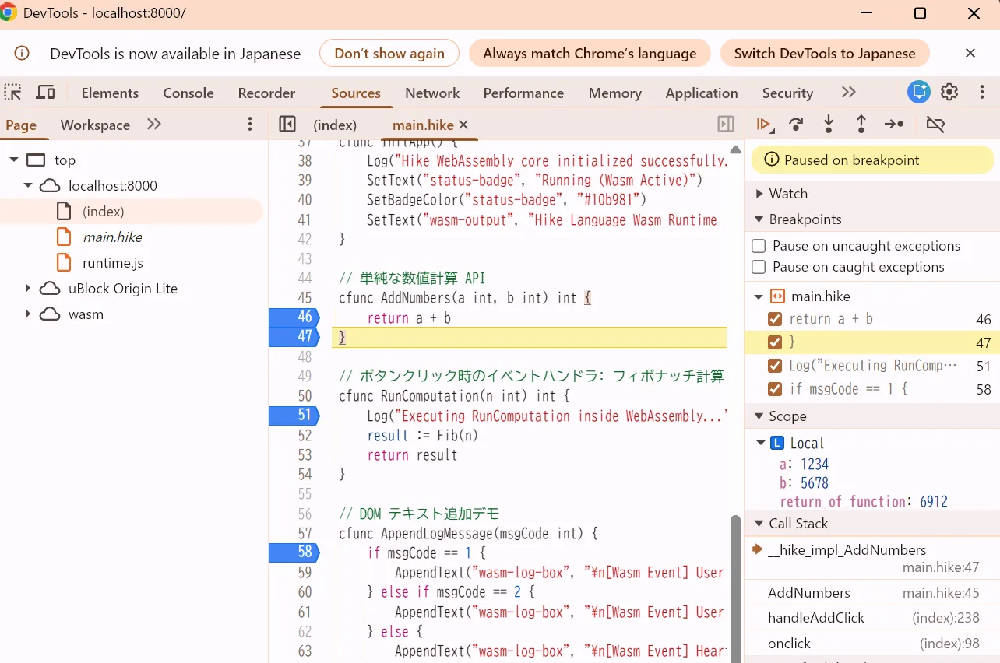

# Hike (`hike-lang`)

> **A lightweight, zero-overhead systems programming language targeting Windows, Linux, and WebAssembly.**

A systems programming language with Go-like syntax that compiles to LLVM IR or
WebAssembly, generating C-ABI compliant shared libraries, standalone
executables, and browser-ready Wasm modules.

[](https://golang.org)
[](https://llvm.org)
[](https://webassembly.org/)
[](https://marketplace.visualstudio.com/items?itemName=KATOKanryu.vscode-hike)
[](LICENSE)



*Chrome DevTools showing source-level breakpoints, local variables, and a
function return value while running Hike WebAssembly.*

---

## Full Source Debugging with One Flag

Build Hike with `-g` and debug the original `.hike` source instead of stepping
through generated LLVM IR, WAT, or JavaScript glue code. The same source-level
workflow is available for both native and WebAssembly targets:

```bash
# Native: debug with the usual GDB/LLDB or VS Code integration.
hikec build -target linux -g main.hike -o main

# WebAssembly: debug the original source in Chrome DevTools and place the
# source-map URL relative to the hosted Wasm files.
hikec build -target wabt -g --source-map-base ./ main.hike -o main.wasm
```

The WABT debug build writes `main.wasm.map` beside `main.wasm` and embeds a
`sourceMappingURL` custom section pointing to it. Set
`--source-map-base=/assets/wasm` when the Wasm and map files are served below a
different URL prefix. If DWARF should be the only browser debug mapping, use
`--no-source-map`; the map file is still generated, but its URL is not embedded
in the Wasm module.

### Native & WebAssembly: Same Source, Same Debug Experience

The compiler emits DWARF information for native binaries and Wasm DWARF custom
sections for the WABT target. This makes source-line breakpoints, stepping, and
local-variable inspection available in the debugger that matches the target:

| Capability | Native build | WebAssembly build |
| --- | --- | --- |
| Debug switch | `-g` | `-g` |
| Debug format | DWARF | DWARF in Wasm custom sections |
| Debugger | GDB, LLDB, or VS Code | Chrome DevTools |
| Source view | Original `.hike` files | Original `.hike` files in Sources |
| Inspection | Locals and return values | Locals and return values |

### Zero-Runtime yet Full-Observability

Hike keeps the execution model small: there is no garbage collector and no
always-on language scheduler. Runtime support is emitted only when the program
uses a runtime-backed feature. Debug information is likewise opt-in, so release
builds remain lean while `-g` builds provide the information needed for precise
source-level debugging.

### No Emscripten or wasm-bindgen Required

For the browser-oriented WABT flow, Hike generates the Wasm module and the
required `runtime.js` integration as part of the build. No handwritten
JavaScript glue, Emscripten setup, `wasm-bindgen` packaging, or source-map
configuration is required to start debugging:

```bash
cd examples/browser
make build
make serve
```

Open the page in Chrome, press F12, and select the `.hike` source in the
**Sources** panel. Set a breakpoint on a Hike statement and inspect locals while
the Wasm code is running. The browser example demonstrates the complete flow,
including source-level stepping and return-value inspection.

## Status & Environment

> **Note:** Hike is under active development. Full native builds and test suites are verified on **Windows and Linux using Clang/LLVM**, alongside browser/Node.js WebAssembly targets.

### Current project progress

The compiler currently supports LLVM IR and WAT generation, native and
wasm32/WABT builds, generic type/function specialization, closures with escape
analysis, interfaces, collections, inline assembly, region allocation,
threadable and concurrent module variables, and an automated native/WASM test
suite. Recent implementation work has also
established a length-aware string representation with shared substring views,
reference counting, and copy-on-write mutation.

Parts of the test suite already use a Hike-implemented compiler as a
self-hosted prerequisite. Native self-hosting is therefore exercised, while
running the self-hosted Hike compiler after compiling it to WebAssembly still
requires validation.

The language and memory designs are actively evolving. Region allocation and
area allocation are explicit memory models, with compiler-wide lifetime
inference for temporary and shared string buffers implemented alongside them.
See the linked design documents below for the exact implementation boundaries.

### Documentation overview

| Document | Summary |
| --- | --- |
| [`alloc-region.md`](alloc-region.md) | Region allocation, arena lifetime, escape promotion, diagnostics, examples, and limitations. |
| [`area-allocation.md`](area-allocation.md) | Area blocks, scoped memory reuse, deep-copy requirements, and native/WASM behavior. |
| [`encoding.md`](encoding.md) | UTF-8 rules, string and buffer layouts, shared substring views, reference counting, and copy-on-write. |
| [`wasm.md`](wasm.md) | wasm32 target behavior, JavaScript runtime integration, exports, memory access, and testing. |
| [`concurrency.md`](concurrency.md) | Async tasks, channels, worker synchronization, closure transfer, and generated task bridges. |
| [`thread-variables.md`](thread-variables.md) | Threadable and concurrent module variables, visibility, storage, and synchronization rules. |
| [`external-module.md`](external-module.md) | External module declarations, `hikec get`, repository checkouts, and release source archives. |
| [`eventloop.md`](eventloop.md) | Event-loop abstractions built on channels, task invocation, and asynchronous result handling. |
| [`build-constraints-and-assembly.md`](build-constraints-and-assembly.md) | Build constraints and the inline assembly syntax and lowering rules. |
| [`without_cgo.md`](without_cgo.md) | C-ABI integration without cgo, `.syso` builds, and ownership rules at language boundaries. |
| [`gpu/webgpu/Hike.md`](gpu/webgpu/Hike.md) | WebGPU-oriented Hike integration and GPU programming notes. |

---

## Overview

Hike is a lightweight systems programming language combining Go-style syntax and
ergonomics with C-equivalent execution, direct C-ABI compatibility, and no
garbage collection.

The Hike compiler (`hikec`) has two WebAssembly-capable backends. The LLVM
backend lowers Hike to LLVM IR (`.ll`), allowing Clang/LLVM to apply its
optimization pipeline before producing native binaries or optimized
`wasm32-unknown-unknown` modules. The WABT backend lowers directly to WAT, the
standard WebAssembly text representation, and uses `wat2wasm` to produce a
module without an LLVM round trip. This direct path is the foundation for
Hike's WebAssembly DWARF and browser-debugging support.

The compiler builds standalone executables, C-compatible shared libraries (`.dll` / `.so`), and WebAssembly modules (`.wasm`). When exporting library functions, `hikec` automatically generates corresponding C/C++ header files (`.h`).

---

## Key Features

* **Go-Inspired Ergonomics**: Multi-return values, slices, structs, type inference (`:=`), and generic type parameters.
* **Zero Runtime Overhead**: No GC pauses, no always-on language scheduler, and standard C memory layout. Runtime support is emitted as internal backend functions, so unused facilities can be eliminated from the final binary; programs that do not use runtime-backed features need no runtime code.
* **Compile-Time Monomorphization**: Generic functions and types are fully specialized during compilation without dynamic dispatch penalties.
* **First-Class C-ABI Support**: Emits pure C-ABI binaries and automatically emits matching `.h` headers for C/C++ host integration.
* **2-Pass Stack Iterators**: Custom containers can provide zero-allocation `for-range` traversal using compile-time stack allocation (`alloca`).
* **Closures with Escape Analysis**: Lexical closures capture by reference. Variables escaping their stack lifetime are promoted to the heap, unified under a 2-word fat pointer ABI.
* **Built-in Module Management**: `hike.mod` declares dependencies with `require`, and `hikec get` downloads them into the project-local `.hike/deps` tree.
* **Dual WebAssembly Backends**: Use LLVM/Clang for an optimized `wasm32` module, or WABT for direct WAT-to-Wasm generation and browser-oriented debugging.
* **Optional Region Allocation**: `--alloc=region` groups eligible function-local allocations into bump arenas and releases them in O(1) at the region boundary.
* **Scoped Area Memory**: `area(...) { ... }` provides explicit, thread-local scoped storage with bulk release at block exit; values that outlive the block must be copied explicitly.
* **Threadable Module Variables**: Threadable variables are isolated per worker thread, while concurrent variables provide language-level atomic or locked access across workers.
* **Practical Multithreading**: Area memory, threadable module variables, concurrent module variables, channels, and `Async` combine to make common multithreaded programs easier to express without requiring a garbage collector or an always-on scheduler.
* **Length-Aware Strings**: Native strings use a fat representation with a backing pointer, byte offset, and byte length; substring views share storage and writes use copy-on-write when necessary.
* **Source-Level DWARF Debugging**: Generates debug metadata for VS Code, GDB, and LLDB, plus Wasm DWARF custom sections for Chrome DevTools when using `-target wabt -g`.

---

## Inline Assembly

Hike supports function-level LLVM inline assembly through the `__asm__ { ... }`
construct. The first line inside the block declares the operand mapping. The
following entries are the assembly template, output constraints, input
constraints, and clobber constraints:

```go
func encryptBlockFast(roundKeys *byte, dst *byte, src *byte) {
    __asm__{
        params: roundKeys, dst, src
        "movups (%2), %xmm0\n",
        "movups (%0), %xmm1\n",
        "pxor %xmm1, %xmm0\n",
        "movups %xmm0, (%1)\n",
        "",
        "r,r,r",
        "~{xmm0},~{xmm1},~{memory}"
    }
}
```

`%0`, `%1`, and `%2` refer to the operands listed after `params:`. They are
translated to LLVM inline-assembly operand references; other assembly text is
preserved. Register names such as `%xmm0` remain hardware register names.
Clobbers must declare registers and memory modified by the assembly. Native
instructions must be protected with build constraints such as `amd64`; a
portable implementation should be provided for targets such as wasm32.

The complete build-constraint and assembly rules are documented in
[`build-constraints-and-assembly.md`](build-constraints-and-assembly.md).

---

## Architecture

```text
[ .hike Source Code ]
           │
           ▼  (hikec: Go Frontend, Typecheck, Monomorphization)
  [ AST & Desugaring ]
     ├───► Auto-Generated C/C++ Header (.h) [Optional via -header]
     ├───► LLVM Backend ──► LLVM IR (.ll) ──► Clang/LLVM optimizer
     │                                      ├──► Native executable/library
     │                                      └──► Optimized wasm32 module
     │
     └───► WABT Backend ──► WAT ──► wat2wasm
                                      └──► Wasm + DWARF/source mapping
                                           └──► Chrome DevTools

```

---

## Requirements & Building

### Prerequisites

* **Go**: 1.21+

* **LLVM / Clang**: 15.0+ (`clang` and `lld` in your `PATH`)

* **Windows Toolchain**: MinGW-w64 GCC runtime (`x86_64-w64-windows-gnu`)

* **Make** (MinGW / MSYS2 / Linux / macOS)

* **Python**: 3.8+ (for integration test suites)

* **WABT**: `wat2wasm` in your `PATH` when using `-target wabt`

* **Wasmtime**: Used by the WASM test suites to execute generated WebAssembly modules

* **GDB or LLDB**: Required for debugging native binaries built with DWARF debug information; Wasm DWARF debugging is supported through Chrome DevTools


### Building the Compiler

```bash
git clone https://github.com/kanryu/hike-lang.git
cd hike-lang

# Run Unit Tests
go test ./...

# Build Compiler CLI Driver
go build -o hikec.exe ./cmd/hikec

```

### Exporting source symbols

Use `--export-symbols` to write a JSON catalogue of the identifiers found in
the loaded Hike program:

```bash
hikec emit-ir --export-symbols symbols.json main.hike
```

The catalogue contains imported modules, free functions, global variables,
local variables (including parameters), and interface-compatible methods
grouped under `fixed_receivers` with their receiver type. Built-in interface
capabilities are included in the same group. Structs and interfaces are
included with their members and method sets; structs, interfaces, members,
functions, and fixed receivers use package-qualified names.

---

## Language Tour & Syntax Reference

### 1. Variables, Types & Constants

Hike supports explicit type declarations and local type inference via `:=`. Primitive types map to fixed-width representations: `int` (`i64`), `float64` (`double`), `byte` (`u8`), and `bool` (`i1`). The native `string` type is a length-aware fat value: `{ i8*, i32, i32 }`, occupying 16 bytes on 64-bit targets and 12 bytes on wasm32.

```go
package main

var globalCounter int = 0
const MaxLimit int = 1024

func DemoVariables() {
    var a int = 42
    var b float64 = 3.14159
    var isEnabled bool = true
    var msg string = "Hello, Hike!"

    // Type inference
    count := 100
    ratio := 0.75
}

```

---

### 2. Pointers & Structs

Structs follow C memory layouts without hidden metadata or GC headers. Raw pointer operations do not incur runtime tracking.

```go
package main

type Point struct {
    X float64
    Y float64
}

type Rectangle struct {
    TopLeft     Point
    BottomRight Point
}

func CreatePoint(x float64, y float64) Point {
    return Point{X: x, Y: y}
}

// Pass by pointer to avoid copying
func OffsetPoint(p *Point, dx float64, dy float64) {
    p.X = p.X + dx
    p.Y = p.Y + dy
}

```

---

### 3. Functions & Multiple Return Values

Functions are first-class constructs and support multiple return values.

```go
package main

func SafeDivide(a int, b int) (int, bool) {
    if b == 0 {
        return 0, false
    }
    return a / b, true
}

func DemoFunctions() {
    result, ok := SafeDivide(10, 2)
    if ok {
        // Use result
    }
}

```

---

### 4. Control Flow

Hike supports `if` statements with short variable declarations, standard 3-clause `for` loops, `for-range` iterations, and `switch` statements.

```go
package main

func DemoControlFlow(values [5]int) int {
    sum := 0

    // 1. If with initializer
    if n := len(values); n > 0 {
        sum = sum + 1
    }

    // 2. 3-clause for loop
    for i := 0; i < 5; i = i + 1 {
        sum = sum + values[i]
    }

    // 3. for-range loop over fixed arrays
    for idx, val := range values {
        if val < 0 {
            continue
        }
        sum = sum + val
    }

    // 4. Switch statement
    status := 200
    switch status {
    case 200:
        sum = sum + 10
    case 404, 500:
        sum = sum - 1
    default:
        sum = 0
    }

    return sum
}

```

---

### 5. Arrays & Slices

Fixed-size arrays allocate contiguous memory inline. Slices provide dynamic views backed by a three-word header: pointer, length, and capacity.

```go
package main

func DemoArrays() {
    // Fixed-size array
    var arr [4]int
    arr[0] = 10
    arr[1] = 20

    primes := [3]int{2, 3, 5}

    // Slice expression
    sub := primes[1:3]
}

```

---

### 6. Zero-Cost Monomorphized Generics

Generic functions and struct definitions are specialized into concrete implementations at compile time, eliminating runtime dispatch overhead.

```go
package main

// Generic function with type union constraint
func Min[T int | float64](a T, b T) T {
    if a < b {
        return a
    }
    return b
}

// Generic struct
type Pair[K, V] struct {
    Key   K
    Value V
}

func DemoGenerics() {
    minInt := Min(10, 20)           // Specializes Min__int
    minFloat := Min(3.14, 2.71)     // Specializes Min__float64

    p := Pair[string, int]{Key: "hike", Value: 1}
}

```

#### ConstGenerics

Hike also supports compile-time value parameters for generic types. A const
generic declaration must contain at least one type parameter, and const
parameters must appear after all type parameters. Const arguments are limited
to immediate primitive values or other const-generic parameters; ordinary
variables and expressions involving runtime values are rejected.

```go
type Matrix[T, Rows uint, Cols uint] struct {
    data [Rows * Cols]T
}

func MatrixValue() int {
    var m Matrix[int, 8, 8]
    return 8 * 8
}
```

`Matrix[int, 8, 8]` is materialized as a concrete compile-time
specialization. The dimensions are available to layout and indexing code, so
the resulting fixed-size matrix has no runtime dimension metadata.

```go
const Rows uint = 8
const Cols uint = 8
var m Matrix[int, Rows, Cols]
```

See the generic transformation and interface tests for additional examples of
type and const-parameter specialization.

---

### 7. Generic Hash Map (`std/maps`) & Indexing Sugar

Hike provides a generic hash map implementation (`std/maps`) with syntax sugar for indexing, membership testing, deletion, and `for-range` traversal.

```go
package main

import "std/maps"

func printf(format string, ...) int

func main() int {
    // Initialize map with initial bucket capacity
    hmap := maps.New[string, int](8)

    // Subscript assignment sugar
    hmap["Tokyo"] = 1400
    hmap["Osaka"] = 880
    hmap["Nagoya"] = 230

    // Comma-ok lookup idiom
    if val, ok := hmap["Osaka"]; ok {
        printf("Osaka population: %d\n", val)
    }

    // for-range traversal (stack-allocated iterator)
    for city, population := range hmap {
        printf("  - %s: %d\n", city, population)
    }

    // Removal and length query
    delete(hmap, "Nagoya")
    printf("Remaining entries: %d\n", len(hmap))

    return 0
}

```

---

### 8. Custom Subscripting & 2-Pass Stack Iterator Protocol

Any user-defined struct can implement the **Map Behavior** protocol to enable indexing syntax (`obj[k]`, `obj[k] = v`, `len(obj)`, `delete(obj, k)`) and `for-range` loops.

To eliminate heap allocations during `for-range` iterations over custom containers, Hike uses a 2-pass protocol:

1. **Pass 1 (Size Probe)**: `InitIterator(nil)` returns the state buffer byte size.


2. **Stack Allocation**: The compiler issues an `alloca` instruction on the caller's stack frame.


3. **Pass 2 (Initialization)**: `InitIterator(buf)` initializes the allocated state buffer in-place.


4. **Iteration**: `Next(buf)` runs on each step, returning pointers to the current key/value and a continuation flag.


```go
package main

type Entry[K, V] struct {
    Key   K
    Value V
}

type CustomDictionary[K, V] struct {
    Entries []Entry[K, V]
}

func (d *CustomDictionary[K, V]) Set(key K, val V) {
    for i := 0; i < len(d.Entries); i = i + 1 {
        if d.Entries[i].Key == key {
            d.Entries[i].Value = val
            return
        }
    }
    d.Entries = append(d.Entries, Entry[K, V]{Key: key, Value: val})
}

func (d *CustomDictionary[K, V]) Get(key K) (V, bool) {
    for i := 0; i < len(d.Entries); i = i + 1 {
        if d.Entries[i].Key == key {
            return d.Entries[i].Value, true
        }
    }
    var zero V
    return zero, false
}

func (d *CustomDictionary[K, V]) Len() int {
    return len(d.Entries)
}

func (d *CustomDictionary[K, V]) Delete(key K) {
    for i := 0; i < len(d.Entries); i = i + 1 {
        if d.Entries[i].Key == key {
            d.Entries[i] = d.Entries[len(d.Entries)-1]
            d.Entries = d.Entries[:len(d.Entries)-1]
            return
        }
    }
}

// --- 2-Pass Iterator Methods ---

type DictIterator struct {
    Index int
}

func (d *CustomDictionary[K, V]) InitIterator(buf *byte) int {
    if buf == nil {
        return 8 // sizeof(DictIterator)
    }
    it := (*DictIterator)(buf)
    it.Index = 0
    return 0
}

func (d *CustomDictionary[K, V]) Next(buf *byte) (*K, *V, bool) {
    it := (*DictIterator)(buf)
    if it.Index >= len(d.Entries) {
        return nil, nil, false
    }
    entry := &d.Entries[it.Index]
    it.Index = it.Index + 1
    return &entry.Key, &entry.Value, true
}

func DemoMapBehavior() {
    var dict CustomDictionary[string, int]

    // Uses indexing sugar
    dict["itemA"] = 100
    dict["itemB"] = 200

    // Traverses with zero heap allocation
    for k, v := range dict {
        // ...
    }
}

```

---

### 10. Concurrency, Channels & Streaming

`Async` schedules a closure for asynchronous execution and returns a typed one-shot task handle. The receive operator `<-` waits for completion and unpacks the return value or values.

```go
task := Async(func() int {
    return 40 + 2
})

result := <-task
```

Channels are typed synchronization queues. They can be used directly for producer/consumer pipelines, including staged streaming downloads:

```go
type Download struct {
    Blocks chan int
}

func (d *Download) InitIterator(buf *byte) int {
    return 0
}

func (d *Download) NextChannel(buf *byte) (chan int, bool) {
    return d.Blocks, true
}

func download() *Download {
    result := &Download{Blocks: make(chan int, 3)}
    Async(func() int {
        result.Blocks <- 10
        result.Blocks <- 20
        result.Blocks <- 30
        return 0
    })
    return result
}

func consume() int {
    total := 0
    stream := download()
    for block := range <-stream {
        total = total + block
    }
    return total
}
```

The `InitIterator` and `NextChannel` method pair is the `AsyncIterable[T]` protocol defined in `std/collections`. `for value := range <-stream` receives blocks in channel order and can stop early with `break`. Both concrete streams and interface-typed streams are lowered through their respective method dispatch paths, including the concurrent WebAssembly runtime.

For memory-heavy or highly concurrent code, combine this protocol with the
memory models described in [`area-allocation.md`](area-allocation.md) and
[`thread-variables.md`](thread-variables.md). Area blocks provide explicit
scoped storage, threadable variables avoid cross-worker sharing, and concurrent
variables provide synchronized shared state.

---

### 11. First-Class Functions, Closures & Escape Analysis

Functions can be passed as values, returned from factories, or defined inline as closures.

* **Reference Capturing**: Captured variables maintain reference semantics across calls.


* **Automatic Heap Promotion**: Variables that escape their stack scope (such as parameters returned inside a closure) are automatically promoted to heap allocation (`malloc`).


* **Fat Pointer ABI**: Function values compile to a two-word structure:

$$\text{FuncValue} \implies \{ \text{i8* fn\_ptr},\, \text{i8* env\_ptr} \}$$


Top-level and stateless functions carry `env_ptr = null`. Closures carry a pointer to the captured environment.


```go
package main

// 'base' is promoted to heap by escape analysis
func makeAdder(base int) func(int) int {
    return func(n int) int {
        return base + n
    }
}

func main() int {
    add100 := makeAdder(100)
    result := add100(42) // => 142

    counter := 0
    increment := func() int {
        counter = counter + 1 // Mutates outer variable
        return counter
    }

    increment()
    increment()
    finalCount := increment() // finalCount == 3

    return 0
}

```

---

## C-ABI Export & Shared Library Generation

Any top-level function taking POD types or pointers can be exported to C-ABI. Passing `-header <name.h>` instructs `hikec` to emit a C/C++ header matching the exported functions.

### Hike Implementation (`libcalc.hike`)

```go
package main

type Vector2D struct {
    X float64
    Y float64
}

func Add[T int | float64](a T, b T) T {
    return a + b
}

func HikeAddInt(a int, b int) int {
    return Add(a, b)
}

func HikeAddFloat(a float64, b float64) float64 {
    return Add(a, b)
}

func HikeDotProduct(v1 *Vector2D, v2 *Vector2D) float64 {
    return (v1.X * v2.X) + (v1.Y * v2.Y)
}

```

### Compilation Commands

```bash
# 1. Emit LLVM IR and C/C++ header
hikec emit-ir -header libcalc.h -o libcalc.ll libcalc.hike

# 2. Build shared library and import library using Clang
clang -shared -O3 -Wl,--export-all-symbols -Wl,--out-implib,libcalc.dll.a libcalc.ll -o libcalc.dll

```

### Auto-Generated Header (`libcalc.h`)

```c
#ifndef HIKE_LIBCALC_H
#define HIKE_LIBCALC_H

#include <stdint.h>
#include <stdbool.h>
#include <stddef.h>

#ifdef __cplusplus
extern "C" {
#endif

#ifndef HIKE_API
  #if defined(_WIN32) || defined(__CYGWIN__)
    #define HIKE_API __declspec(dllimport)
  #else
    #define HIKE_API extern
  #endif
#endif

typedef struct Vector2D {
    double X;
    double Y;
} Vector2D;

HIKE_API int64_t HikeAddInt(int64_t a, int64_t b);
HIKE_API double HikeAddFloat(double a, double b);
HIKE_API double HikeDotProduct(Vector2D* v1, Vector2D* v2);

#ifdef __cplusplus
}
#endif
#endif

```

### C++ Host Client (`main.cpp`)

```cpp
#include <iostream>
#include "libcalc.h"

int main() {
    int64_t sumInt = HikeAddInt(400, 600);
    double sumFloat = HikeAddFloat(1.414, 1.732);

    Vector2D v1 = { 3.0, 4.0 };
    Vector2D v2 = { 2.0, 5.0 };
    double dot = HikeDotProduct(&v1, &v2);

    std::cout << "SumInt: " << sumInt << std::endl;
    std::cout << "Dot: " << dot << std::endl;
    return 0;
}

```

Compile and link C++ directly:

```bash
clang++ -O3 main.cpp libcalc.dll.a -o client.exe
./client.exe

```

## Direct C Interoperability (Zero-Overhead C-ABI)

Unlike Go, which requires `cgo`, preambles, wrapper generation, and runtime stack-switching overhead, Hike interacts with C at zero runtime cost.

Because `hikec` compiles directly to standard LLVM IR and delegates code generation to Clang, a function declaration without a body (`func ...`) is emitted as a standard external C-ABI symbol declaration (`declare`).

### 1. Standard C Runtime (libc)

You can call standard C library functions simply by declaring their signatures in your `.hike` source. The Clang backend automatically links the C runtime (libc / MinGW-w64 / MSVCRT) and resolves the symbols directly.

```go
package main

// Declare standard C library functions directly
func printf(format string, ...) int
func puts(str string) int

func main() int {
    puts("Hello directly from C libc!")
    printf("Formatted number: %d\n", 42)
    return 0
}

```

### 2. Third-Party C Libraries

To integrate third-party C libraries (e.g., SQLite, Raylib, OpenSSL):

1. **Declare the C API**: Write matching function signatures without bodies in your Hike code.


2. **Link via Clang**: Pass `-l<lib>` or direct paths to static (`.a` / `.lib`) or dynamic (`.so` / `.dll` / `.dylib`) libraries during build.


#### Example (`main.hike`)

```go
package main

// External library declaration (e.g., libcurl or a custom C library)
func my_c_library_init() int
func my_c_calculate(a int, b int) int

func main() int {
    if my_c_library_init() != 0 {
        return 1
    }
    res := my_c_calculate(10, 20)
    return 0
}

```

#### Build & Link Command

```bash
# 1. Emit LLVM IR
hikec emit-ir -o main.ll main.hike

# 2. Compile and link external C library with Clang
clang -O3 main.ll -L/path/to/libs -lmy_c_library -o app.exe

```

---


## Module Management (`hike.mod`)

Hike resolves local dependencies and package roots via `hike.mod` in the project root.
External Hike packages can be imported by declaring a `require` directive and
running `hikec get`. The command downloads the requested project into
`.hike/deps`, after which its packages are available through normal Hike
imports.

```text
module my-project

hike 0.1.0

require github.com/kanryu/hike-gpu-webgpu v0.1.0

```

```bash
hikec get
```

When a package should be resolved from a directory relative to the project,
`replace` can be used. The path is resolved from the project module root; it
does not download or manage an external dependency:

```text
replace github.com/kanryu/hike-gpu-webgpu => ../../gpu/webgpu
```

Use `require` with `hikec get` for project-managed external dependencies, and
use `replace` when a package should be resolved through a project-relative
directory.

For repository checkouts, release source archives, and dependency refresh
behavior, see [`external-module.md`](external-module.md).


---


## Working with Slices (`std/slices`)

The standard library provides generic collection operations for slices, conforming to standard functional and Go-like semantics. All operations are monomorphized at compile time with zero overhead.

### API Reference

* `Filter[T](s []T, predicate func(item T) bool) []T`: Returns a new slice containing elements that satisfy the predicate.
* `Map[T, U](s []T, transform func(item T) U) []U`: Returns a new slice where each element is mapped via `transform`.
* `IndexFunc[T](s []T, predicate func(item T) bool) int`: Returns the index of the first element satisfying the predicate, or `-1` if not found.
* `Find[T](s []T, predicate func(item T) bool) (T, bool)`: Returns the first matching element and a boolean flag indicating success.
* `SortFunc[T](s []T, cmp func(a T, b T) int)`: Performs an in-place quicksort using a three-way comparison function (`a < b` returns negative, `a == b` returns 0, `a > b` returns positive).
* `SortBy[T](s []T, less func(a T, b T) bool)`: Performs an in-place quicksort using a boolean comparison predicate (`a < b` returns true).

### Example

```go
package main

import (
    "std/slices"
)

func printf(format string, ...) int

func main() int {
    nums := []int{5, 2, 8, 1, 9, 4}

    // 1. Filter elements
    evens := slices.Filter[int](nums, func(x int) bool {
        return x % 2 == 0
    })

    // 2. Map elements
    mapped := slices.Map[int, int](evens, func(x int) int {
        return x * 10
    })

    // 3. Search elements
    val, ok := slices.Find[int](nums, func(x int) bool {
        return x > 5
    })
    idx := slices.IndexFunc[int](nums, func(x int) bool {
        return x > 5
    })
    printf("Find: %d (ok: %d), Index: %d\n", val, ok, idx)

    // 4. In-place sorting
    slices.SortFunc[int](nums, func(a int, b int) int {
        return a - b // Ascending
    })

    slices.SortBy[int](nums, func(a int, b int) bool {
        return a > b // Descending
    })

    return 0
}

```


---

## Working with JSON (`std/encoding/json`)

The standard library provides DOM parsing, traversal, mutation, serialization, and file I/O.

```go
package main

import (
    "std/encoding/json"
)

func printf(format string, ...) int

func main() int {
    // 1. Read file content
    content := json.ReadFile("data.json")
    if len(content) == 0 {
        printf("Failed to read data.json\n")
        return 1
    }

    // 2. Parse DOM tree
    doc := json.Parse(content)
    if doc == nil {
        printf("Failed to parse JSON\n")
        return 1
    }

    // 3. Access fields
    nameVal := doc.Get("name")
    verVal := doc.Get("version")
    if nameVal != nil {
        printf("Name: %s\n", nameVal.AsString())
    }
    if verVal != nil {
        printf("Version: %d\n", verVal.AsInt())
    }

    // 4. Mutate DOM
    doc.Set("modified_by", json.NewString("hikec"))
    newStats := json.NewObject()
    newStats.Set("active_threads", json.NewNumber(8.0))
    doc.Set("stats", newStats)

    // 5. Serialize and write back
    outStr := json.Stringify(doc)
    json.WriteFile("output.json", outStr)

    return 0
}

```

---

## WebAssembly Support

Hike provides two WebAssembly build paths. Choose the backend with
`-target`:

| Target | Backend | Best for |
| --- | --- | --- |
| `wasm32` | LLVM/Clang | Optimized, compact, high-performance Wasm modules |
| `wabt` | Direct WAT + `wat2wasm` | Source-level debugging in browser DevTools |

The `wasm32` target lowers through LLVM IR, allowing the LLVM/Clang optimizer
to produce a compact and fast WebAssembly module. The `wabt` target emits the
standard WebAssembly text representation directly and converts it with WABT.
Because this path keeps the source-to-Wasm mapping under Hike's control, it is
the recommended backend for debugging Hike source in Chrome DevTools. Hike will
continue to strengthen the WABT backend as its primary direct-WebAssembly
pipeline.

Both backends emit the internal runtime support needed by the program and can
generate the JavaScript runtime for the selected host mode. The generated
Wasm modules are intended to run across WebAssembly hosts including browsers,
Node.js, and other runtimes that provide the standard WebAssembly JavaScript
API.

The generated WASM modules are intended to run across WebAssembly host
environments, including web browsers, Node.js, and other WASM runtimes that
provide the standard WebAssembly JavaScript API. In a web browser, a module
can be used immediately by referencing the generated `runtime.js` and the
`.wasm` binary from an HTML page; the runtime handles instantiation and exposes
the Hike exports to the page's JavaScript.

### Build and run

```bash
# Optimized Wasm through LLVM/Clang.
hikec build -target wasm32 -o main.wasm main.hike

# Direct WAT/WABT build for Chrome DevTools source debugging.
hikec build -target wabt -g --source-map-base ./ -o main.wasm main.hike

# The same host model can be exercised through Node.js.
hikec run -target wasm32 main.hike
```

`build` produces the `.wasm` module and automatically writes `runtime.js` in
the output directory. A WABT debug build also writes `main.wasm.map` and
embeds its `sourceMappingURL` custom section unless `--no-source-map` is
specified. `run` builds a temporary module and starts Node.js with the
generated runtime. This is the same host model used by the automated WASM
tests.

### Normal and concurrent runtimes

Use `-wasm-mode normal` for ordinary exported functions and
`-wasm-mode concurrent` when the program uses asynchronous tasks, workers, or
directed JavaScript callbacks:

```bash
hikec build -target wasm32 -wasm-mode normal -o app.wasm main.hike
hikec build -target wasm32 -wasm-mode concurrent -o app.wasm main.hike
hikec emit-js -target wasm32 -wasm-mode concurrent -o runtime.js main.hike
```

The generated runtime is reusable from both browsers and Node.js. Browser code
can instantiate the module and call exported `cfunc` functions in response to
events. Node.js tests load the same generated runtime with `require` or ES
module import and invoke the exports directly. Each WASM test keeps its
JavaScript driver separate while sharing the runtime implementation.

### JavaScript and Hike strings

WASM host functions receive string data through the generated ABI bridge. Hike
code can expose byte-pointer and length parameters when a direct host buffer
interface is preferred, then construct a Hike string from that pair:

```go
cfunc TransformString(input *byte, length int) cstring {
    value := string(input, length)
    return cstring(value + " [wasm]")
}
```

The runtime provides UTF-8 encoding/decoding helpers and access to linear
memory. Hike `int` values use WebAssembly `i64` and should be passed from
JavaScript as `BigInt`; `int32`, `byte`, and `bool` use `i32`-compatible values.
Hike strings are length-aware fat values internally, while C-facing exports
are adapted to pointer-based ABI values by the compiler.

### JavaScript host example

```javascript
import { HikeRuntime } from "./runtime.js";
import fs from "node:fs/promises";

const runtime = new HikeRuntime();
const wasm = await runtime.load("main.wasm");
const result = wasm.AddNumbers(1234, 5678);
console.log(result);
```

For browser integration, instantiate the generated runtime after loading the
`.wasm` asset and call exported functions from event handlers. For Node.js,
the `tests/wasm` suite provides examples covering maps, strings, concurrent
workers, and JavaScript functions (`jfunc`).

The full host API, memory model, and integration examples are documented in
[`wasm.md`](wasm.md).

---

## Source-Level Debugging in VS Code

Passing `-g` instructs `hikec` to emit LLVM DWARF metadata, enabling source-level breakpoints, single-stepping, and variable inspection in VS Code using GDB or LLDB.

### `.vscode/tasks.json`

```json
{
  "version": "2.0.0",
  "tasks": [
    {
      "label": "Build Hike Debug Executable",
      "type": "shell",
      "command": "hikec ${file} -g -o${fileDirname}/main.ll && clang -g -O0 ${fileDirname}/main.ll -o${fileDirname}/app.exe",
      "options": {
        "cwd": "${fileDirname}"
      },
      "group": {
        "kind": "build",
        "isDefault": true
      },
      "problemMatcher": ["$gcc"]
    }
  ]
}

```

### `.vscode/launch.json`

```json
{
  "version": "0.2.0",
  "configurations": [
    {
      "name": "Debug Hike Program (F5)",
      "type": "cppdbg",
      "request": "launch",
      "program": "${fileDirname}/app.exe",
      "args": [],
      "stopAtEntry": false,
      "cwd": "${fileDirname}",
      "environment": [],
      "externalConsole": false,
      "MIMode": "gdb",
      "miDebuggerPath": "gdb",
      "preLaunchTask": "Build Hike Debug Executable",
      "setupCommands": [
        {
          "description": "Enable pretty-printing for gdb",
          "text": "-enable-pretty-printing",
          "ignoreFailures": true
        }
      ]
    }
  ]
}

```

Pressing **`F5`** compiles the active `.hike` file and launches the debug session, supporting breakpoints, Step Over (`F10`), Step Into (`F11`), and variable inspection.

---

## CLI Reference (`hikec`)

```text
Usage: hikec <command> [options] <source.hike... | directory>

Commands:
  go        Compile a directory of .go.hike files into one .syso object
  get       Download modules listed in hike.mod into .hike/deps
  emit-ir   Generate target LLVM IR (.ll) (default for a source input)
  emit-js   Generate the WebAssembly JavaScript runtime.js bridge
  build     Compile Hike source into a native or WebAssembly binary via Clang
  run       Build and immediately execute a native or WebAssembly program

Common options:
  -o <path> / -o=<path>
                  Output path. For emit-ir this is .ll; for emit-js it is
                  runtime.js; for build it is the executable or .wasm.
  -target <name> / --target=<name>
                  Target triple or shorthand: windows, windows-msvc, linux,
                  darwin, wasm32, wasm64, or wabt.
  -v / --verbose  Enable verbose logging.
  -vv / --vv      Enable detailed instruction-level logging.

Options for emit-ir:
  -header <path> / --header=<path>
                  Generate a C/C++ header for exported declarations.
  -wasm-mode <mode> / --wasm-mode=<mode>
                  WebAssembly runtime mode: normal or concurrent.
  --alloc=region / -alloc=region
                  Enable optional function-scoped region allocation.
  -cflags <flags> / -cflags=<flags>
                  Accepted for command compatibility; native linker flags are
                  applied by build rather than emit-ir.

Options for emit-js:
  -wasm-mode <mode> / --wasm-mode=<mode>
                  Generate the normal or concurrent JavaScript runtime.
  --alloc=region / -alloc=region
                  Compile the source with region mode enabled.

Options for build:
  -target wabt
                  Build through WAT/WABT and emit a browser-oriented Wasm
                  module with automatically generated runtime.js.
  -wasm-mode <mode> / --wasm-mode=<mode>
                  WebAssembly runtime mode: normal or concurrent.
  --alloc=region / -alloc=region
                  Enable optional function-scoped region allocation.
  -cflags <flags> / -cflags=<flags>
                  Extra flags passed directly to Clang.
  -g              Generate DWARF debug metadata and use a debug-friendly
                  native compilation configuration. For `-target wabt`, also
                  emit Wasm DWARF custom sections and a `.wasm.map` file.
  --source-map-base <url> / --source-map-base=<url>
                  URL prefix for the embedded source-map URL and source URLs.
                  The map is written beside the output Wasm file.
  --no-source-map  Do not embed the `sourceMappingURL` custom section. The
                  `.wasm.map` file is still written for external use.

Options for run:
  -wasm-mode <mode> / --wasm-mode=<mode>
                  Forward the normal or concurrent mode to the WASM build.
  --alloc=region / -alloc=region
                  Forward region allocation mode to the build.
  -cflags <flags> / -cflags=<flags>
                  Forward additional Clang flags to the build.
  -g              Forward debug information generation to the build.

Options for go:
  -o <path> / -o=<path>
                  Output the aggregated `.syso` object path.
  -target <name> / --target=<name>
                  Target platform or triple for the generated object.
  -v / --verbose  Enable verbose logging.
  -vv / --vv      Enable detailed logging.

Unknown non-option arguments are treated as source files or directories. The
`emit-ir`, `emit-js`, and `build` commands require at least one input source.

```

---

## Roadmap

* [x] External module imports and `hikec get` dependency installation

* [x] Interface-valued `AsyncIterable` dispatch for `for value := range <-stream`


* [x] Optional function-scoped region allocation (`--alloc=region`)
* [x] Complete lexical lifetime inference and release handling for local string and slice values, including heap promotion for returned values and fixed-buffer reuse for repeated appends


* [ ] Package registry and remote dependency resolution


* [x] Self-hosting compiler frontend in Hike for the currently covered test paths
* [ ] Validate the self-hosted Hike compiler when built and executed as WebAssembly

The memory and concurrency models are intentionally explicit: area blocks,
threadable variables, and concurrent variables are available today, while
additional lifetime diagnostics and broader platform coverage remain future
work.


---

## License

MIT License
